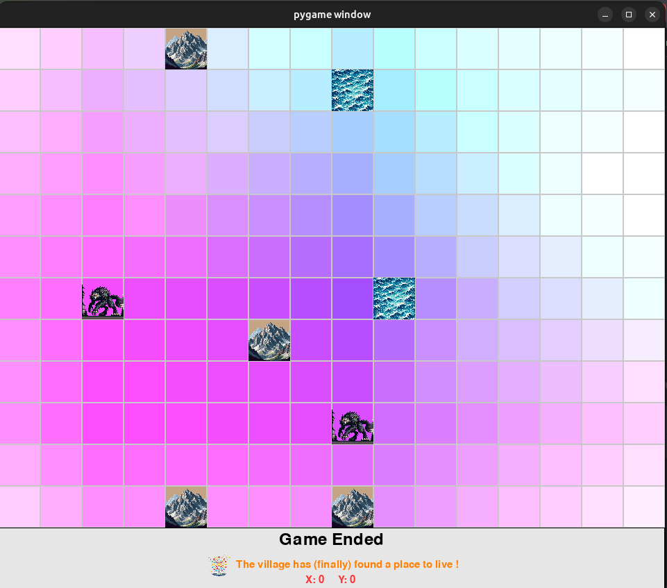

# Wolf and Sheep Influence Map Game

## Introduction
Welcome to the Wolf and Sheep Influence Map Game, an interactive grid-based strategy game implemented using Pygame. This game is designed to calculate an influence map based on environmental elements such as mountains, wolves, and water sources. The primary goal is to determine the optimal location for placing a village by analyzing the influence of these elements.

## Game Mechanics
- The game presents a grid with mountains randomly placed on the map.
- Players can place wolves and water sources on the grid. Wolves represent danger (enemies), and water sources represent safety (allies).
- Once all pieces are placed, the influence map is calculated in grayscale, indicating the safest areas to establish a village.

## Implementation Details
- The game leverages Pygame for its graphical interface and event handling.
- It consists of several Python modules that handle different aspects of the game:
  - `main.py`: The main game loop and state management.
  - `draw.py`: Functions for drawing the grid, pieces, and the influence map.
  - `events.py`: Event handling, including mouse clicks and key presses.
  - `influence.py`: Logic for calculating the influence map.
  - `settings.py`: Game settings and constants.

## Visual Representation
The game underwent visual iterations for the influence map. Initially, it featured a color-coded map, which proved to be less efficient for visual clarity.

### Initial Version: Color Influence Map

The first version utilized a color influence map, which made it challenging to discern boundaries and optimal village placement.

### Final Version: Grayscale Influence Map

The grayscale version provided a more distinct and efficient representation, leading to its adoption in the final game design.

### Game Start: Placement Phase

Here is the initial game state where players place wolves and water sources to strategize their influence on the grid.

## How to Play
1. Start the game and observe the grid with randomly placed mountains.
2. Left-click to place a water source (ally), and right-click to place a wolf (enemy).
3. Once all pieces are placed, press `Space` to calculate the influence map.
4. The game will display the grayscale influence map and the optimal location for the village.
5. Press `Escape` to end the game.

## Development Choices
- The switch from a color influence map to grayscale was due to the need for better visual clarity in determining the safest areas.
- Pygame was chosen for its simplicity and effectiveness in creating interactive grid-based games.

## Future Improvements
- Add functionality for dynamic grid sizes and custom placement of mountains.
- Improve the influence algorithm for more complex scenarios.

## Installation
To play the game, ensure you have Pygame installed, and run `main.py`.

## Credits
Developed by Joseph Beasse as a project for the course "IA pour les jeux vidéos" at Enseirb-Matmeca, 2024.
